# Worthy Nomad 
### A Mental Health Awareness Project

Worthy Nomad is a web page about Mental health awareness.
It consists of general information as well as advice and individual help for the elderly, men,  women, teenagers, children, and workplace mental health issues.

There is a link for people who need help urgently as well as tips to help improve your wellness.

## 🤷‍♀️ About

This website is my first solo project for the fullstack web design boot camp with Code Intitute.
It is to show learning in HTML, CSS GitHub, VSCode and bootstrap, along with showcasing AI as a tool to assist in the build.

## Steps in Preparation

### ☒ Wireframe
   This was done using good old fashioned pencil and paper.

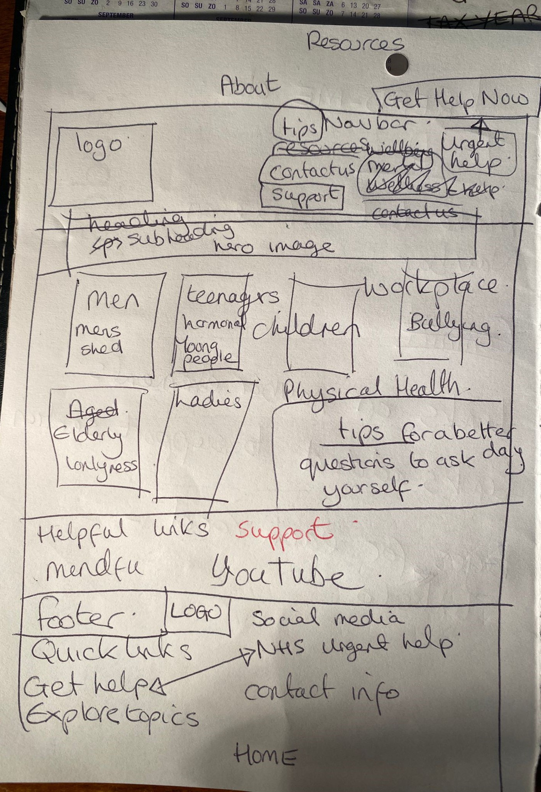

### 📖 Users Stories 

I used Microsoft Co-pilot to create user stories by using the prompt "write user stories for a basic mental health awareness website"

This gave me some ideas but it was clear I needed to refine the prompt.  I included 'as a site owner' and also prompted it to include the criteria and task list. 

I had a total of 35 user story ideas from co-pilot and manually contructed my user stories from these suggestions.

### 🎨 Colour Palette
The colour palette was chosen from the image I had chosen for the Hero Image.  I used https://color.adobe.com/create/image to extract the individual colours.

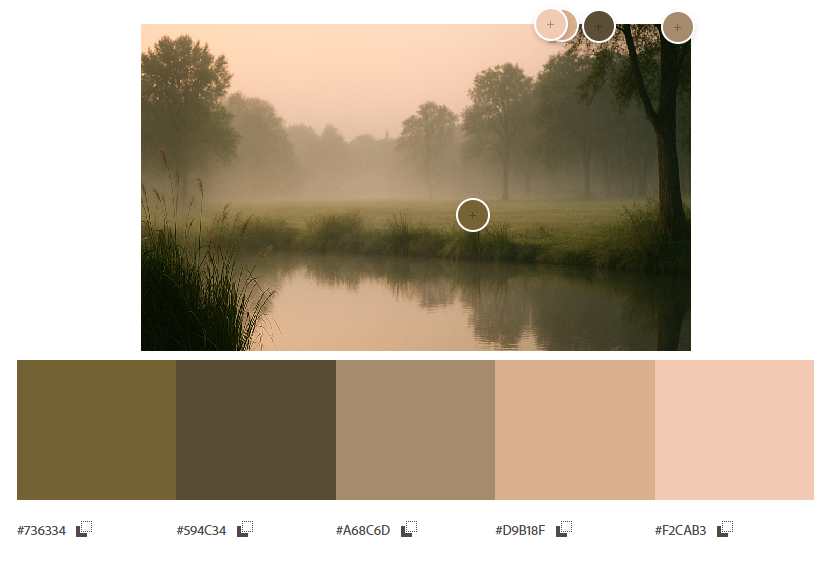  

### The Logo

I asked ChatGPT to create a logo for a calming mental health awareness website.  It created one with a heart in a brain in a head.  It did not match the overall feel I was going for but I liked the heart in the brain, so I asked it to make the brain into a flower.

## 🏗️ The Build

With the repository in GitHub and a folder created for VS Code I began by creating the boilerplate using shorthand ! **[TAB]**  then copy and pasted the links to bootstrap.  Then the structure was started using AI.

I enabled the Live Server extension in VSCode so I could track progress in my browser.

### The Navbar 
This was created with this prompt to co-pilot. 
"create a responsive navbar element with links to home, about, support, tips and GET HELP NOW" These links were later refined to the actual pages on the website.  

The colour of the GET HELP NOW button was changed from 'danger' to 'warning'. The target was set to _blank and rel to noopener noreferrer to make it open in a seperate page. 

I made the logo I created with chat GPTthat the favicon and the logo on the navbar, using Co-pilot's help to modify the code. I added one of the colours from my colour palette as the background-color of my navbar.

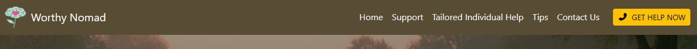

### The Header
I added a header section with a hero image generated using co-pilot.  I then used the hero image to create my colour palette using https://color.adobe.com/create/image.  

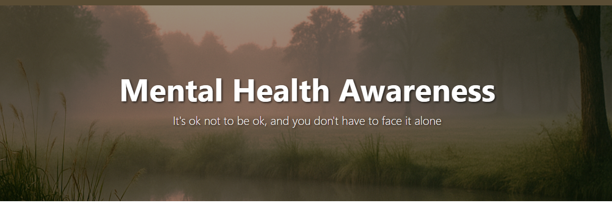

### About Us
The next section created was the About Us section with two headings and paragraphs of text.  The background was left white to create a contrast between the header and the section below.

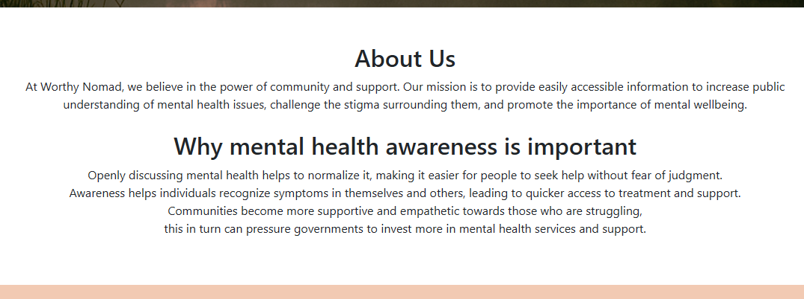

### Tailored Help Section
The 'We are all individual' section was created with the following prompt to co-pilot.
"Create section using bootstrap 5 with 6 cards containing header, paragraph and image"
The images were generated using Microsoft co-pilot. 

I hit a challenge on one of the images as I had asked co-pilot to create an image of a sad woman in a kitchen with children at a kitchen table eating dinner. I received this message -
"I can’t generate that image due to safety policies around depicting distress in domestic settings. If you’re working on a story or project and need help visualizing a scene or exploring emotional dynamics, I’d be glad to help in another way."  

So all my images now contain happy or neutral looking people.

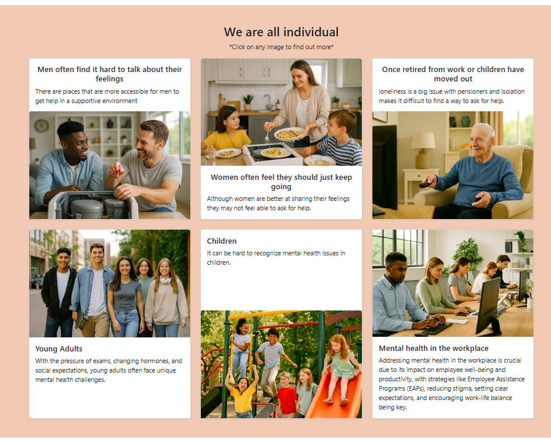

I wanted to link each of the 6 cards to seperate pages which could be themed differently to reflect the subject more appropriately.  

Using this prompt "how do I make the heading on a card a link to another page" I created the 'Men' page and linked the 'Men' card to that page.
Co-pilot asked "Or if you want the entire card to be clickable, wrap the whole card:" and gave me the code to do this.  This is the code I chose to use.

A background-color was chosen for the cards and footer sections from the colour pallete generated earlier.

Anchor links were put on each of the Navbar buttons with corresponding id="" on the relevant sections.

HTML pages were added for children, men, women, workplace, pensioners and young adults so that the messages and links could be tailored to different groups.  The navbar and footer were copied over to each page to maintain consistency and continuity accross the site.

Here is a screen shot of the 'Men' card.

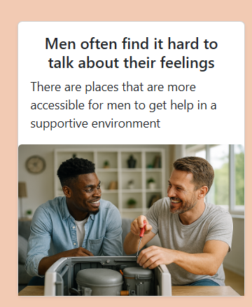

And this is the 'men' page.

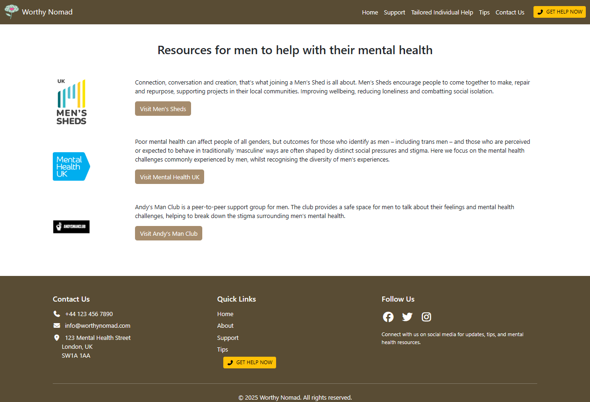

### Support and Useful links
Underneath the Individual Cards section, I created the 'Support and Useful links' section with links to a range of useful sites and information sites.  In the future, some of this information can be put on the site, to make it more accessible. These links were flagged by the WCAG accessibility for not having enough contrast, So I put each link into a hollow button.

### Tips for mental Wellbeing

These sections had different background colours to denote different sections.  

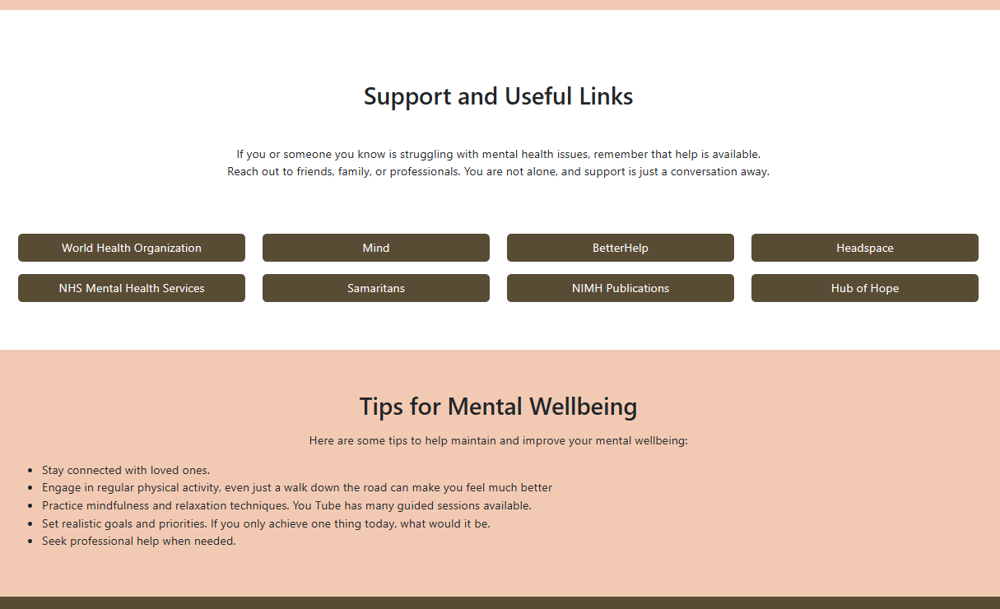

### Footer
The footer was created with this prompt - "Create a footer with contact, address, and email elements and links to facebook, twitter, instagram" 

The footer includes the contact section, quick links and Social Media links.  
The GET HELP NOW button is also repeated here, and links directly to the NHS mental health servicespage

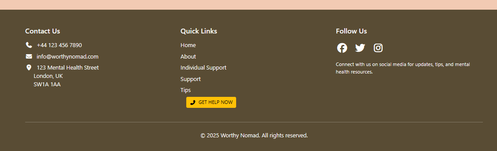

## 🌟Main Features

✅ Simple, Clean Design
- Minimalist layout with generous white space.

- Soft color palette (beige, neutrals) creates a calming atmosphere.

- Clear visual hierarchy with large headings and distinct sections.

🧭 Easy Navigation
- Anchor-based navigation (e.g. #home, #support) allows smooth scrolling.

- Sectioned content by audience (Men, Women, Pensioners) makes it intuitive to explore.

- Prominent “Get Help Now” button provides quick access to support.

🧠 Mental Health Focus
- Welcoming message (“It’s ok not to be ok…”) sets a compassionate tone.

- Each demographic card links to tailored mental health content.

- Emphasis on emotional safety and inclusivity.

📱 Mobile-Friendly Layout
- Responsive design adapts well to smaller screens.

- Cards and buttons remain legible and accessible on mobile devices.

🖼️ Inclusive Imagery
- Hero images reflect diverse age groups and everyday settings.

- Visuals are emotionally neutral and serene, supporting the site’s calming intent.

🔒 Privacy-Conscious
- No login or data collection required to access resources.

- Encourages anonymous exploration of mental health topics.

## 💻 Built With

GitHub  
VSCode  
HTML  
CSS  
Bootstrap  
Co-pilot  
Blood, Sweat, Tears

## Accessibility and Performance

The website was checked against the WCAG guidelines to ensure the web content is sufficiently accessible to people with disabilities with this site https://accessibilitycheck.friendlycaptcha.com/

Initially the score was 92%.  

One comment issue was the absence of a Captcha to protect against spam.  As we have not learned this and it is not in the criteria, I did not add a Captch, but I will bear this in mind in future projects if applicable.

One issue I can solve is the links in the 'Useful Links' section had insufficient colour contrast of 4.5, when the expected is 7.1.  This was be solved by putting the links into buttons or having a contrasting background on this section. 

Before the links were amended to buttons.               
 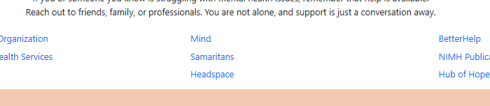  
 After the buttons were amended

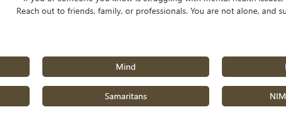  

Another issue is that the social media links do not have discernable text that is visible to screen readers.  This was solved by including an aria-label.

After these issues were addressed, the site was 100% compliant

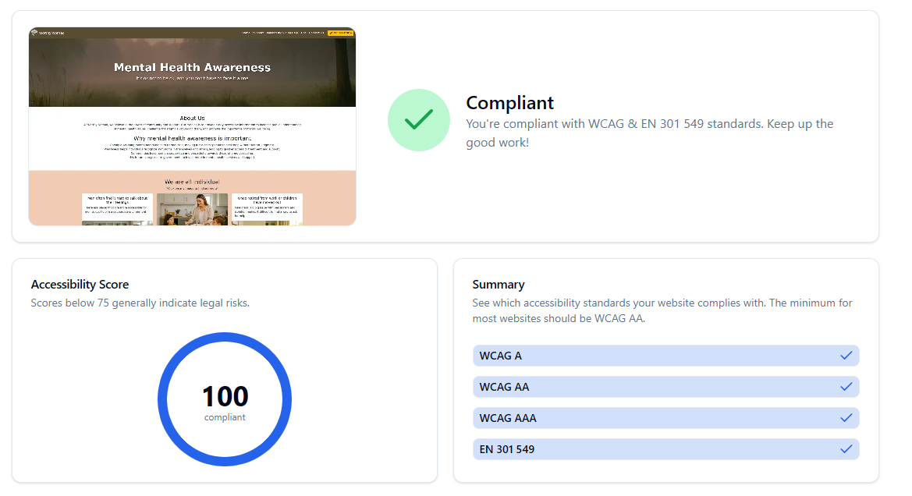

The website acheived a performance of 71% on lighthouse (Dev tools)

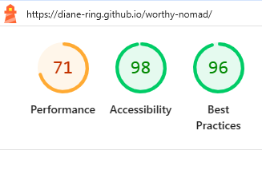

## AI insights

AI tools significantly streamlined the workflow and development of my website by accelerating ideation, design, and content refinement.  
It generated sample code for me to structure the website and checked for mistakes when the code didnt work as expected.

I used it to generate my logo, all other images, drafted user stories and acceptance criteria, and ensured alignment with WCAG standards. 

Ultimately it was a background assistant, and was invaluable in the building of this website.

## Future developement 

As I worked through the build of this website, I used mainly inline styling.  For future development I would move the majority of styling to the style.css folder.  
I would like to expand on the Tips section to include more helpful advice, maybe links to appropriate YouTube videos, facebook pages, instagram stories.   
A page on common mental health issues and their sypmptoms would be a welcome addition. 
Also information on physical contributors to poor mental health could be really helpful.  
There is a website that generates Positive Afirmations on demand.  I think it would be good to include an Affirmation of the Day as well.  

# ..
This site is published on GitHub pages at this address:
https://diane-ring.github.io/worthy-nomad/  

